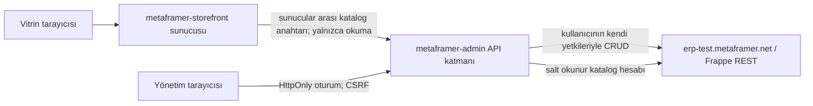

# Metaframer headless: uygulama planı

Tarih: 17 Eylül 2026

## Hedef

ERPNext v16 üzerinde gerçek ürün verisiyle çalışan iki bağımsız uygulama. İlk teslim ürün kataloğu, ürün detayı/varyantları ve giriş gerektiren ürün yönetimi. Kurulu 21 Frappe uygulamasının tamamına özel ekran geliştirmek sonraki aşamalardadır. Sentry kapsam dışıdır.

## İki reponun bağlantısı

- ERPNext tek veri kaynağıdır. Uygulamalar ayrı ürün veritabanı tutmaz.
- Admin reposu hem yönetim arayüzünü hem Frappe API adaptörünü içerir.
- Vitrin reposu yönetim reposunun sürümlü, sadece okuma sağlayan katalog API'sine sunucudan bağlanır.
- Parola, Frappe oturumu ve sunucular arası anahtarlar tarayıcı JavaScript'ine veya Git'e girmez.
- Katalog için yalnızca belirlenen ürün grubu (`Metaframer Demo` varsayılanı), etkin satış ürünleri yayımlanır. Tüm stok envanteri otomatik olarak halka açılmaz.
- Admin güncellemesinden sonra vitrin yeni API isteğinde güncel Frappe kaydını okur; kalıcı önbellek ve gizli mock fallback yoktur.

## İş adımları

1. REST sözleşmesi ve oturum güvenliğini tanımla.
2. Paralel: vitrin arayüzü, admin arayüzü, Frappe adaptörü ve entegrasyon.
3. Arama, sayfalama, yükleniyor/boş/hata durumları, mobil kartlar, masaüstü tablo, erişilebilir form ve silme onayı.
4. Gerçek siteye bağlan; ayrılmış demo ürünleriyle oluştur/oku/güncelle/sil testleri. Varyant şablonu ve varyantları doğrula.
5. Mobil (390), tablet (768), laptop (1280), masaüstü (1536) görünüm ve klavye kullanımını denetle.
6. Test sonuçlarını gerçek servis testleri ve kontrollü test çiftleri olarak ayrı raporla; iki GitHub reposuna kod ve kurulum belgelerini gönder.

## Teknoloji

React + TypeScript + Vite; Node.js 24 / Express API sunucusu. Her repo tek servis olarak çalışır ve Docker ile dağıtılabilir. OpenAPI sözleşmesi admin reposunda asıl kaynak, vitrin reposunda sürümlü kopyadır.

## Kabul ölçütleri

- Başarısız Frappe isteği kullanıcıya hata olarak görünür; başarı bildirimi yalnızca onaylı yanıtla çıkar.
- Gerçek Frappe kullanıcısı giriş yapar, yetkisiz/oturumsuz yazma engellenir.
- Oluşturulan kayıt Frappe'de görülür, güncelleme tekrar okunduğunda kalıcıdır, silinen kayıt bulunamaz.
- Vitrin aynı kaydı ve değişikliklerini gösterir; varyantlar gerçek Item ilişkilerinden gelir.
- Kimlik bilgileri, çerezler, ham Frappe traceback'leri istemciye/loglara sızmaz.
- Canlı test için erişim henüz sağlanmamışsa bu durum açıkça belirtilir; test geçti denmez.
